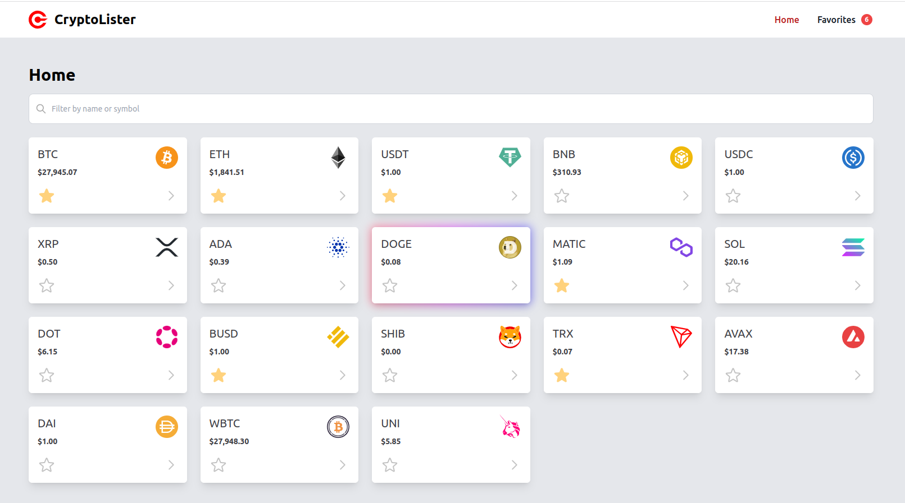
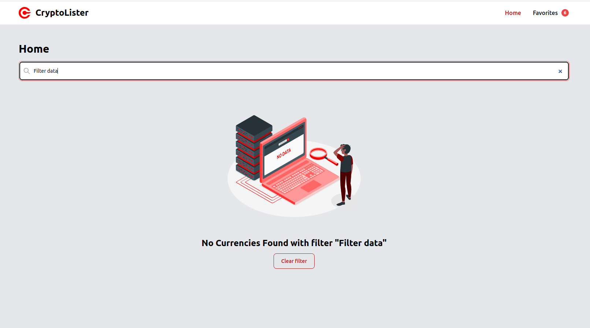
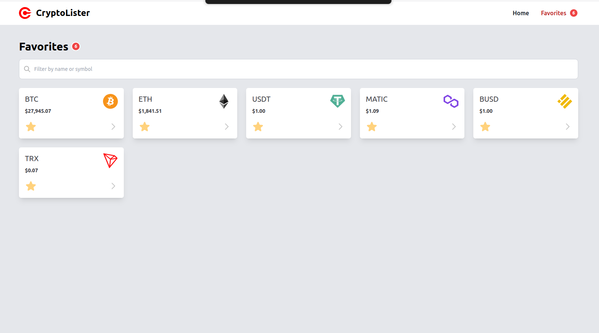
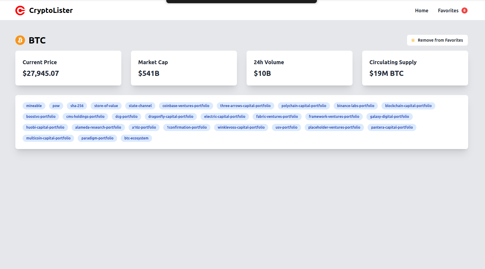

<h3 align="center">CryptoLister</h3>

 

# About

## Tasks to be done

### Installation
1. Clone this repository to your local machine.
2. Install the required dependencies by running `npm install`.
3. Start the development server by running `npm run dev`.
4. Open your browser and navigate to http://localhost:3000.

### Coding tasks
1. Go to the `CurrencyList.vue` component.
2. Show the value of the `filter` variable in the `div` `#filter-value`.
3. Implement the `isFilterActive` computed prop. - The computed prop `isFilterActive` should return `true` if the filter field is empty, otherwise `false`.
4. Make the contents of `#has-active-filter` to be dynamic: - Use the `isFilterActive` computed prop to conditionally render the contents of the `#has-active-filter` div.
5. Add a button to clear the filter in `#new-component`. - The button should clear the filter field when clicked. - `@click="clearFilter"`
6. Set the default value of the `filter` to be `bitcoin`
7. Allow the filtering of cryptocurrencies by symbol. - The computed prop `currencyListFiltered` should be filtered by `name` OR by `symbol`.
8. Extract the login from the `Set filter to ETH` to a method called `setFilterToETH`. - `@click="setFilterToETH"`
9. Make the filter case-insensitive. - The filter should be case-insensitive. - use `toLowerCase()` or `toUpperCase()`
10. The clear filter button should not be visible when the input field is not empty. Use the `v-if` directive to conditionally render the button.
11. Create new component `TuExercise.vue`. 
12. Put some text like `Hello world` and display the new component into the `CurrencyList.vue`
13. Move the logic from the `#new-component` div to the new component.
14. The new component should receive the `filterValue` prop.
15. The new component should emit an event `clear-filter` when the button is clicked.
16. The new component should emit an event `set-filter-to-eth` when the button is clicked.
17. Go to `CurrencyCard.vue` component.
18. Crete new computed prop `logoSrc` - The computed prop `logoSrc` should return the logo URL of the currency. Use the `symbol` property of the currency to generate the URL. - `/img/svg-crypto-logos/${symbol}.svg`. Use the new `logoSrc` computed prop to display the logo of the currency. `:src="logoSrc"`
19. Make the favorite button work. - The favorite button should toggle the favorite status of the currency. - Use the `toggleFavorite` method to toggle the favorite status of the currency. - `@click="toggleFavorite"`
20. Prevent the page from navigating when the favorite button is clicked. - Use the `prevent` and the `stop` modifiers to prevent the page from navigating when the favorite button is clicked. - `@click.stop.prevent="toggleFavorite"`
21. Make the favorite img to change src when the currency is favorite. - Use the `isFavorite` computed prop to change the src of the favorite img. - The url for the active state is `/img/heart-active.svg` and for the inactive state is `/img/heart-inactive.svg`
22. Extract the logic for the favorite buttn src into computed prop `favoriteSrc`.
23. Push the changes to a new github repository.

## Technologies Used

This project was built using the following technologies:

- **Nuxt.js**
- **Vue.js**
- **Pinia**
- **TypeScript**
- **JavaScript**
- **Node.js**
- **Tailwind**
- **Vite**
- **Cypress**
- **Vitest**
- **ESLint**
- **Prettier**
- **StyleLint**
- **CI/CD with GitHub Actions**

## Screenshots

Here are some screenshots of the project:

